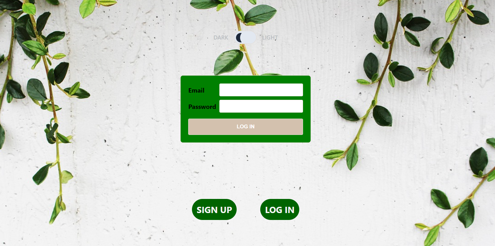

# E-Commerce App

## Introduction

This app is perceived to be the e-commerce app some that could be used to sell and market their products. It is then can be used to view current news and weather. This app is a more convenient way to do business for small entrepreneurs and start-ups withojut spending heavy initial costs.

This app gives the ability to  client to login and make a purchase using his profile and for the business owner this app gives the convenient of having database and other mail connectivity.

## Technologies Used: A list of all technologies, libraries, APIs, etc. used in the project.

### Frontend
The frontend of this project demonstrates:

* An intuitive user interface built using React.js.User-friendly components for user authentication, login, and signup.
* Seamless integration with the backend API for fetching and displaying product items.
* Efficient handling of user interactions such as adding and marking todos as completed. 
* A responsive design that adapts to different screen sizes.

### Backend
The backend of this project highlights:

* A robust RESTful API architecture using Node.js and Express.js.
* User authentication and authorization mechanisms for secure access to the application.
* Endpoints for user login and signup, ensuring secure user registration and login processes.
* Comprehensive CRUD operations for managing todo items, including creation, retrieval, updating, and deletion.
* Proper data storage and management using MongoDB.
* Adherence to security best practices to protect user data and prevent unauthorized access.
* Clear API documentation detailing available endpoints and their functionalities.
* A modular and maintainable code structure that enables future feature expansion.

### Prerequisites

Below noted things you need to install to run this project in your system;

* Node.js
* NPM
* MongoDB
* Nodemon

# Getting Started with Create React App

This project was bootstrapped with [Create React App](https://github.com/facebook/create-react-app).

## Available Scripts

In the project directory, you can run:

### `npm start`

Runs the app in the development mode.\
Open [http://localhost:3000](http://localhost:3000) to view it in your browser.

The page will reload when you make changes.\
You may also see any lint errors in the console.

### `npm test`

Launches the test runner in the interactive watch mode.\
See the section about [running tests](https://facebook.github.io/create-react-app/docs/running-tests) for more information.

### `npm run build`

Builds the app for production to the `build` folder.\
It correctly bundles React in production mode and optimizes the build for the best performance.

The build is minified and the filenames include the hashes.\
Your app is ready to be deployed!

See the section about [deployment](https://facebook.github.io/create-react-app/docs/deployment) for more information.

### `npm run eject`

**Note: this is a one-way operation. Once you `eject`, you can't go back!**

If you aren't satisfied with the build tool and configuration choices, you can `eject` at any time. This command will remove the single build dependency from your project.

Instead, it will copy all the configuration files and the transitive dependencies (webpack, Babel, ESLint, etc) right into your project so you have full control over them. All of the commands except `eject` will still work, but they will point to the copied scripts so you can tweak them. At this point you're on your own.

You don't have to ever use `eject`. The curated feature set is suitable for small and middle deployments, and you shouldn't feel obligated to use this feature. However we understand that this tool wouldn't be useful if you couldn't customize it when you are ready for it.

## Learn More

You can learn more in the [Create React App documentation](https://facebook.github.io/create-react-app/docs/getting-started).

To learn React, check out the [React documentation](https://reactjs.org/).

### Code Splitting

This section has moved here: [https://facebook.github.io/create-react-app/docs/code-splitting](https://facebook.github.io/create-react-app/docs/code-splitting)

### Analyzing the Bundle Size

This section has moved here: [https://facebook.github.io/create-react-app/docs/analyzing-the-bundle-size](https://facebook.github.io/create-react-app/docs/analyzing-the-bundle-size)

### Making a Progressive Web App

This section has moved here: [https://facebook.github.io/create-react-app/docs/making-a-progressive-web-app](https://facebook.github.io/create-react-app/docs/making-a-progressive-web-app)

### Advanced Configuration

This section has moved here: [https://facebook.github.io/create-react-app/docs/advanced-configuration](https://facebook.github.io/create-react-app/docs/advanced-configuration)

### Deployment

This is the link for deployed app;
https://raam5544.github.io/final-capstone-project/

### `npm run build` fails to minify

This section has moved here: [https://facebook.github.io/create-react-app/docs/troubleshooting#npm-run-build-fails-to-minify](https://facebook.github.io/create-react-app/docs/troubleshooting#npm-run-build-fails-to-minify)

## Unsolved Problems:

* Found difficult to store the data, that are pulled with the third party API into the MONGO DB.
*  

Future Enhancements: Identify future features and enhancements planned for the project.

## Acknowledgement

Thanks to the Perunnals for providing a free API key. And thanks to sites that provided images and logos. 
